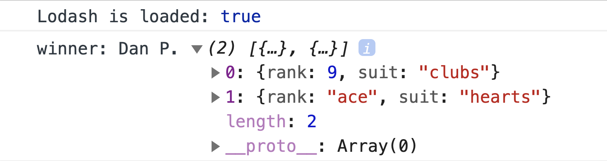

# working-with-collections

Processing collections of data with JavaScript.

### Before You Begin

Be sure to check out a new branch (from `master`) for this exercise. Detailed instructions can be found [**here**](../../guides/before-each-exercise.md). Then navigate to the `exercises/working-with-collections` directory in your terminal.

### Challenge

For this challenge you will be writing a script that runs a simple card game. You'll be dealing **two cards** to each of **four players** and then declaring a winner by scoring their hands.

You may opt to use helper functions found in the [Lodash](https://lodash.com/docs/4.17.15) library to complete this challenge. It has been added to your `index.html`.

> 🤓 Using Lodash is not required but it helped cut the reference solution down to less than 40 lines of code.

Write your code in `main.js`. Here is the high level algorithm of the game. You should use the browser console to check your progress as you go.

1. Create a collection of four objects that represent players. Each player has a unique `name` and a `hand` to hold cards in.

1. Create a collection of fifty-two objects that represent a [standard 52-card deck](https://en.wikipedia.org/wiki/Standard_52-card_deck). Each card should have a `rank` (Ace, 2, 3, ... King) and a `suit` (clubs, diamonds, hearts, spades).

1. Shuffle the deck.

1. Deal two cards to each player. **No two players should be able to receive the same card.**

1. Find the player with the highest score. Each card is worth a specific point value. Aces are worth `11` points, face ranks (Jack, Queen, King) are worth `10` points, and number ranks are worth their value (`2`, `3`, ... `10`).

1. Log the winning player to the console.

    

      
    

1. **OPTIONAL**: Generalize your script by defining a function that runs the game. The function's parameters should be an array of players and the number of cards per hand.

1. **OPTIONAL**: In the case of a tie, run a tie-breaker between the "winners" until there is one winning player remaining.

### Submitting Your Solution

When your solution is complete, return to the root of your `senior-front-end-lessons` directory. Then commit your changes, push, and submit a Pull Request on GitHub. Detailed instructions can be found [**here**](../../guides/after-each-exercise.md).
