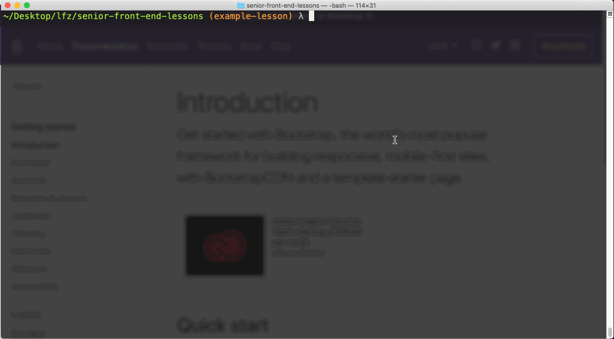
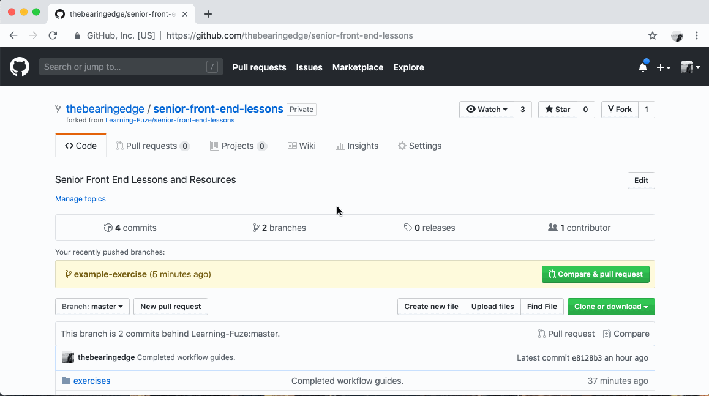

After Each Exercise
--

When you have completed an exercise you'll want to send your solution to the instructors for review.

### Commit and Push to GitHub

To turn in your solution, you'll commit your changes, push them to GitHub, and submit a Pull Request.

If you get stuck committing or pushing your work, be sure to notify an instructor right away.

1. In your terminal, navigate to **the root** of your `senior-front-end-lessons` directory.
2. Check your local repository for unstaged changes.
    ```bash
    git status
    ```
3. Stage the changes you'd like to commit.
    ```bash
    git add exercises/example-exercise
    ```
4. Check the staged changes before committing.
    ```bash
    git status
    ```
5. Commit the changes with a meaningful message.
    ```bash
    git commit -m "Completed example exercise."
    ```
6. Push the new commit(s) to your fork of `senior-front-end-lessons` on GitHub. **The _real_ name of this new branch is the name of the exercise.**
    ```bash
    git push origin example-exercise
    ```



### Open a Pull Request on GitHub

Now that your solution has been uploaded to GitHub, it's time to notify the instructors by submitting a Pull Request.

If you get stuck while opening a Pull Request, be sure to notify an instructor right away.

1. Visit your fork of the `senior-front-end-lessons` repository on GitHub and click **Pull Requests** tab.
2. In the **Pull Requests** tab, click the **New Pull Request** button.
3. Configure the Pull Request:
    - Select **`Learning-Fuze/senior-front-end-lessons`** as the `base` repository.
    - Select **`C000_fLast`** as the `base` branch.
        > For example, if you are in Cohort 319 and your full name is **Linus Torvalds**, then your `base` branch is **`C319_lTorvalds`**.
    - Select your fork as the `head` repository.
        > For example, if your GitHub username is **gitguy**, then your `head` repository is **`gitguy/senior-front-end-lessons`**.
    - Select your exercise branch as the `compare` branch.
        > For example, if the exercise you are completing is named **`example-lesson`**, then your `compare` branch is **`example-lesson`**.
4. Click the **Create Pull Request** button and give your Pull Request a title that makes it easy to identify who it's from and what it's for.
    > For example, if your full name is **Linus Torvalds** and the exercise is named **Example Exercise**, then your Pull Request title should be **Example Exercise - Linus Torvalds**.
5. Click the **Create Pull Request** button. Done!


