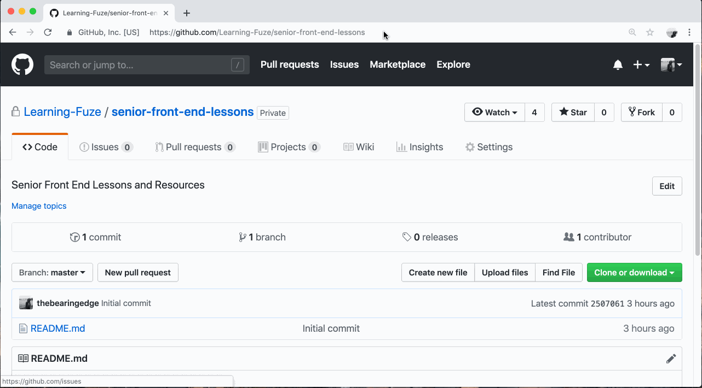
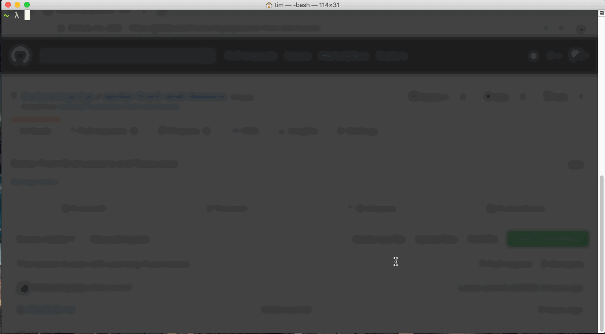
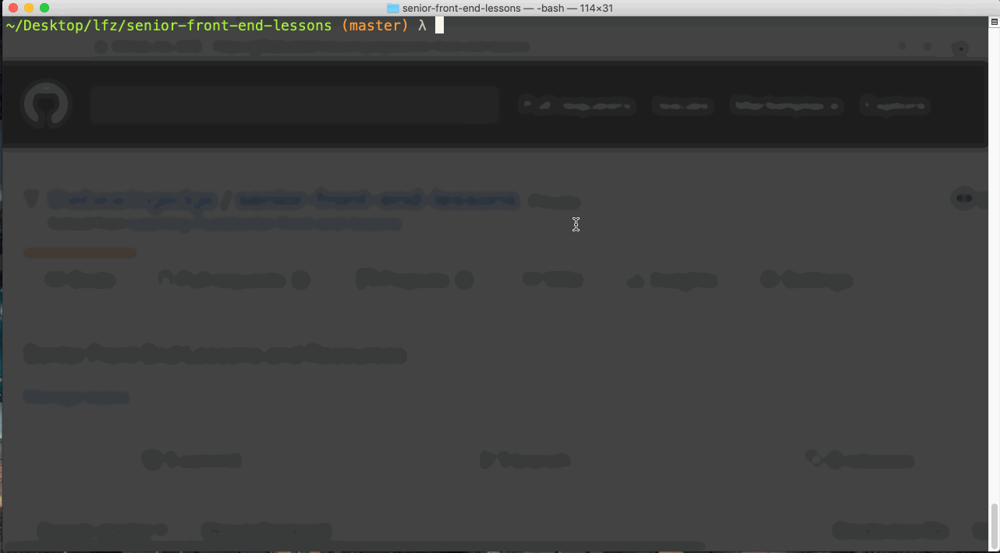

Getting Started
--

To get started, you'll be creating a fork of the `Learning-Fuze/senior-front-end-lessons` repository and cloning your fork to your local machine.

### Fork the Repository on GitHub

Visit the [`Learning-Fuze/senior-front-end-lessons`](github.com/Learning-Fuze/senior-front-end-lessons) GitHub repository and click the **Fork** button. GitHub will create a copy of the repository under your own account.



### Clone Your Fork from GitHub

1. In your terminal, navigate to your `lfz` directory.
2. Visit your fork of the `senior-front-end-lessons` repository on GitHub and copy its URL.
3. Use `git clone` to clone your fork into your local `lfz` directory.



### Add the LearningFuze Upstream Repository

Occasionally, updates to these lessons will be made available by instructors. Adding the original `Learning-Fuze/senior-front-end-lessons` to your local repo's remotes will make receiving the updates easy.

1. In your terminal, navigate to your `senior-front-end-lessons` repository.
2. Run the following command to add the original `Learning-Fuze/senior-front-end-lessons` as a remote repository.
    ```bash
    git remote add upstream https://github.com/Learning-Fuze/senior-front-end-lessons
    ```
3. Run the following command to confirm that `upstream` was added to your local repository.
    ```bash
    git remote -v
    ```



### Install JavaScript Dependencies.

These lessons use Node.js to check your code before you turn it in. Run the following command in the root of your local `senior-front-end-lessons` repository:

```bash
npm install
```

### Done!

You are ready to go! The instructors will let you know which exercise to start with.
