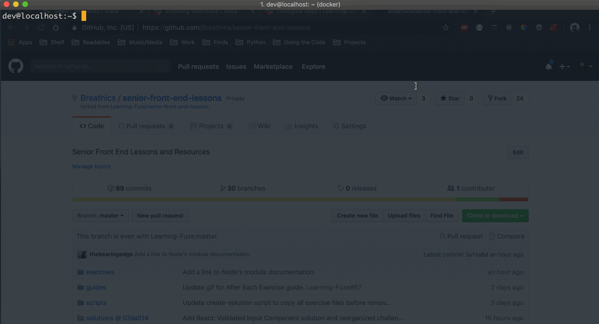

Getting Started
--

### Fork the Repository on GitHub

Visit the [`Learning-Fuze/senior-front-end-lessons`](github.com/Learning-Fuze/senior-front-end-lessons) GitHub repository and click the **Fork** button. GitHub will create a copy of the repository under your own account.


### Clone Your Fork from GitHub

1. In your terminal, navigate to your `lfz` directory.
2. Visit your fork of the `senior-front-end-lessons` repository on GitHub and copy its URL.
3. Use `git clone` to clone your fork into your local `lfz` directory.



### Add the LearningFuze Upstream Repository

1. In your terminal, navigate to your `senior-front-end-lessons` repository.
2. Run the following command to add the original `Learning-Fuze/senior-front-end-lessons` as a remote repository.
```bash
git remote add upstream https://github.com/Learning-Fuze/senior-front-end-lessons
```
3. Run the following command to confirm that `upstream` was added to your local repository.
```bash
git remote -v
```


